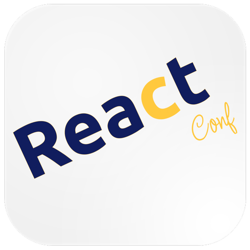
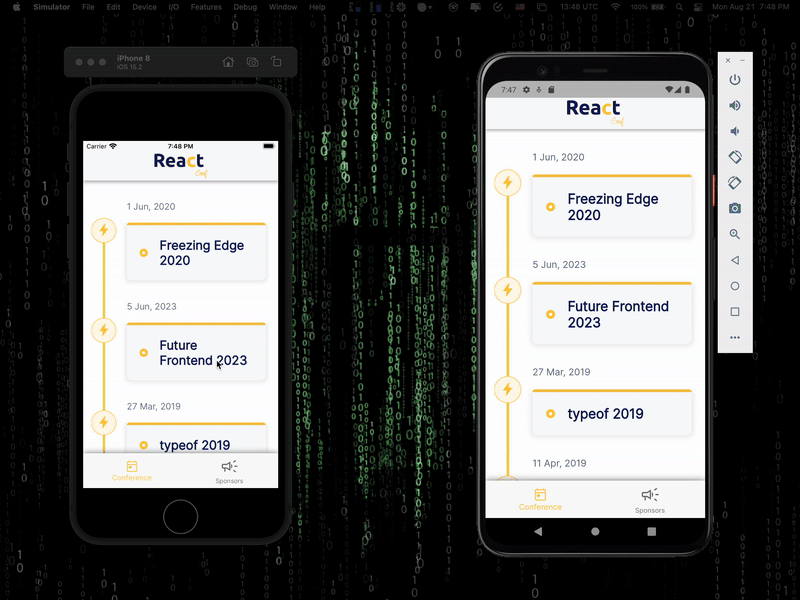

&nbsp;&nbsp;
&nbsp;&nbsp;
<a href="https://choosealicense.com/licenses/mit/" target="_blank"></a>&nbsp;&nbsp;
&nbsp;&nbsp;


# React Conf

</img>
This application is a Pre-assessment for the Mid-Level Flutter Developer position at [Lemon Hive](https://www.lemonhive.com/). You can read the details of the Pre-assessment from the pdf file [here](screenshots/pdf/Flutter-MID_Instruction.pdf).<br /> It's an open-source project, hence use of the source code is governed by an MIT-style license that can be found in the LICENSE file or at [MIT LICENSE Info](https://choosealicense.com/licenses/mit/). This app is using a GraphQL API: [https://api.react-finland.fi/graphql](https://api.react-finland.fi/graphql). Detail information about this GraphQL API chan be found in this GitHub repo: [here](https://github.com/ReactFinland/graphql-api).

## Packages Used

This **React Conf** application is using some third-party packages from the open-source community. Thanks to the developers for these amazing packages. Those third-party packages are:

```yaml
# For fonts (Inter - Typeface)
google_fonts: ^5.1.0
# For displaying time line
timeline_tile: ^2.0.0
# For launching website into the app
url_launcher: ^6.1.12
# For icons
material_symbols_icons: ^4.2668.0
# For rendering svg files
flutter_svg: ^2.0.7
# For accessing graphQL API
graphql_flutter: ^5.1.2
# For DateTime formatting
intl: ^0.18.1
```

<p align="center">
    <a href="https://drive.google.com/file/d/1N7cznrKP1JaxWaMAPTsdvH4uRltp5-ig/view?usp=sharing" target="_blank"></img></a>
  </p>

## App Demo

<p align="center"></p>

## GraphQL Queries Used

- **For fetching conference details with id:**

```graphql
query ConferenceDayQuery {
  allSeries {
    id
    name
    conferences {
      id
      name
      slogan
      startDate
    }
  }
}
```

- **For fetching Organizer's details using the 'conferenceId':**

```graphql
query RootQuery($conferenceId: ID!) {
  conference(id: $conferenceId) {
    partners {
      ...SponsorFragment
    }
  }
}

fragment SponsorFragment on Contact {
  name
  social {
    homepage
  }
  about
  image {
    url
  }
}
```

- **For fetching Speakers's details using the 'conferenceId':**

```graphql
query PageQuery($conferenceId: ID!) {
  conference(id: $conferenceId) {
    speakers {
      name
      about
      social {
        homepage
        github
        twitter
        linkedin
      }
      image {
        url
      }
      country {
        code
      }
    }
  }
}
```

- **For fetching Schedule details using the 'conferenceId':**

```graphql
query PageQuery($conferenceId: ID!) {
  conference(id: $conferenceId) {
    schedules {
      day
      description
      intervals {
        begin
        end
        title
        sessions {
          type
          title
          description
        }
      }
    }
  }
}
```

- **For fetching Sponsor's details using the 'conferenceId':**

```graphql
query RootQuery($conferenceId: ID!) {
  conference(id: $conferenceId) {
    goldSponsors {
      ...SponsorFragment
    }
    silverSponsors {
      ...SponsorFragment
    }
    bronzeSponsors {
      ...SponsorFragment
    }
  }
}

fragment SponsorFragment on Contact {
  name
  social {
    homepage
  }
  about
  image {
    url
  }
}
```

## File Pattern Inside The `lib` Folder

```
    lib/
    ├── core/
    │   ├── config/
    │   │   └── graphql_config.dart
    │   └── const/
    │       ├── app_color.dart
    │       └── text_style.dart
    │
    ├── features/
    │   ├── conference/
    │   │   ├── models/
    │   │   │   ├── conference_model.dart
    │   │   │   ├── organizer_model.dart
    │   │   │   ├── schedule_model.dart
    │   │   │   ├── speaker_model.dart
    │   │   │   └── sponsor_model.dart
    │   │   ├── pages/
    │   │   │   ├── tabs/
    │   │   │   │   ├── organizer_tab.dart
    │   │   │   │   ├── schedule_tab.dart
    │   │   │   │   ├── speaker_tab.dart
    │   │   │   │   └── sponsor_tab.dart
    │   │   │   ├── conference_detail_page.dart
    │   │   │   └── conference_page.dart
    │   │   ├── services/
    │   │   │   ├── bronze_sponsor_gql_service.dart
    │   │   │   ├── conf_page_gql_service.dart
    │   │   │   ├── gold_sponsor_gql_service.dart
    │   │   │   ├── organizer_gql_service.dart
    │   │   │   ├── schedule_gql_service.dart
    │   │   │   ├── silver_sponsor_gql_service.dart
    │   │   │   └── speaker_gql_service.dart
    │   │   └── widgets/
    │   │       ├── custom_conf_card.dart
    │   │       ├── custom_list_tile.dart
    │   │       ├── custom_time_line.dart
    │   │       ├── organizer_card.dart
    │   │       ├── schedule_card.dart
    │   │       ├── speaker_card.dart
    │   │       └── sponsor_card.dart
    │   │
    │   └── sponsor/
    │       ├── page/
    │       │   └── sponsor_page.dart
    │       └── widgets/
    │           └── sponsor_card.dart
    │
    ├── routing/
    │   └── bottom_nav_bar.dart
    └── main.dart
```
